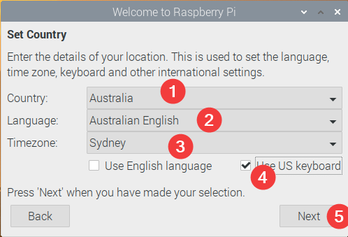
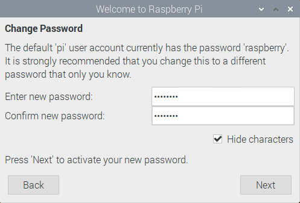
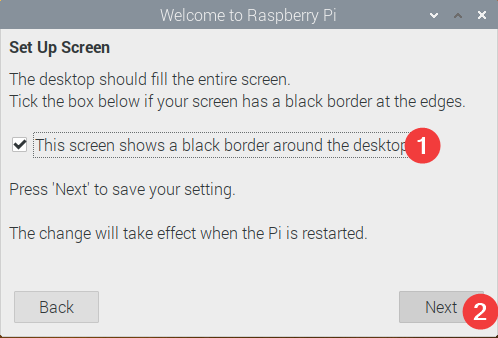
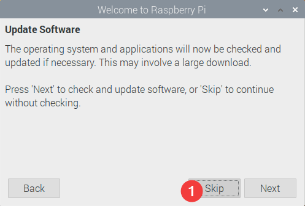
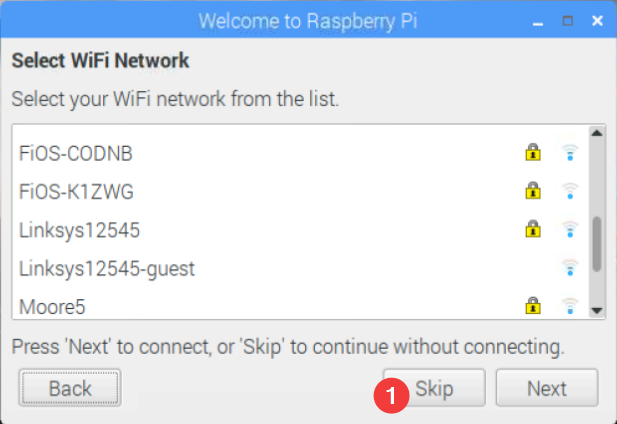
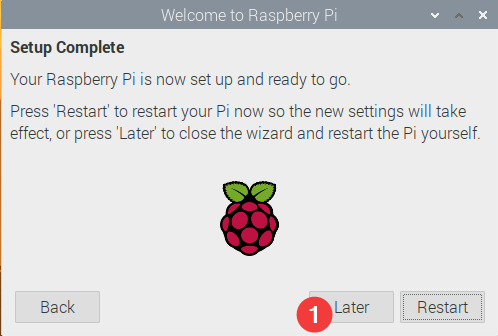

# NxVMSPi OS Setup

## Warning
Although these scripts are public facing, they are not intended for general consumption. Do not blindly run these scrips, they are unsupported. 
You WILL NOT receive technical support if you run these without direction.

## Requirements
You will need
- Raspberry Pi
- MicroSD card of U1 Class or Higher
- Keyboard Mouse & Monitor for Raspberry Pi
- A PC or Laptop to prepare your OS image

1. Download the latest version of Raspbian Buster with desktop from here: https://www.raspberrypi.org/downloads/raspbian/
2. Download Balena Etcher here: https://www.balena.io/etcher/
3. Flash your MicroSD card with the Raspbian image using Balena Etcher
4. On the computer you flashed the MicroSD Card, Open the SD card in explorer and edit the file config.txt
    - Uncomment (Remove the #) the line hdmi_force_hotplug=1
    - This allows USB storage to be automounted on boot even if a screen is not attached.
5. **Optional** In the root directory of the MicroSD create a empty text file with no extension called: ssh 
    - This allows remote SSH in to the Raspberry Pi for troubleshooting without a monitor.
6. Insert MicroSD in to Raspberry Pi
7. Power Up Raspberry Pi
8. Run through out of box Wizard for Raspbian:

- Set up location as follows:



- Set up password, Recommended Default Password: **Ness1234**



- Set up HDMI Overscan Output:



- Skip Updaing for now (We will do it later):



- Skip joining Wifi:



- Finish up, no need to reboot yet:



9. Now proceed to software setup via the NxVMSPi Install Script

# NxVMSPi Install Script

Setup Scripts for Ness VMS Servers, this will:
1. Set Auto Updates for Australian Servers
2. Set Server hostname to last 4 digits of Mac Address
3. Delete unecessary pakages
4. Install required dependencies
5. Update Server OS
6. Download & install Nx Witness Media Server.
7. Download & Set NxWitness Wallpaper

## Requirements
You have installed the latest version of Raspbian on your Raspberry Pi Hardware

## Server Setup

Press Ctrl-Alt-T to launch the system terminal and type in this command:

```bash
sudo wget -O - https://nesscs.com/nessvmspi5 | bash
```
Enter your password when prompted. Once the script completes, reboot the Raspberry Pi by typing this command in to the terminal

```bash
sudo reboot
```

Once the Pi reboots, continue the Nx Witness setup from another machine running the NxWitness Client.

## Reference
- [How to build an NVR with Nx Witness VMS](https://support.networkoptix.com/hc/en-us/articles/360035982154)
- [ARM Single Board Computer (SBC) Support & Installation Instructions](https://support.networkoptix.com/hc/en-us/articles/360033842053)

## Support
There is no support! Contact Kieran for changes.

## License
MIT License

Copyright (c) 2019 Ness Corporation

Permission is hereby granted, free of charge, to any person obtaining a copy
of this software and associated documentation files (the "Software"), to deal
in the Software without restriction, including without limitation the rights
to use, copy, modify, merge, publish, distribute, sublicense, and/or sell
copies of the Software, and to permit persons to whom the Software is
furnished to do so, subject to the following conditions:

The above copyright notice and this permission notice shall be included in all
copies or substantial portions of the Software.

THE SOFTWARE IS PROVIDED "AS IS", WITHOUT WARRANTY OF ANY KIND, EXPRESS OR
IMPLIED, INCLUDING BUT NOT LIMITED TO THE WARRANTIES OF MERCHANTABILITY,
FITNESS FOR A PARTICULAR PURPOSE AND NONINFRINGEMENT. IN NO EVENT SHALL THE
AUTHORS OR COPYRIGHT HOLDERS BE LIABLE FOR ANY CLAIM, DAMAGES OR OTHER
LIABILITY, WHETHER IN AN ACTION OF CONTRACT, TORT OR OTHERWISE, ARISING FROM,
OUT OF OR IN CONNECTION WITH THE SOFTWARE OR THE USE OR OTHER DEALINGS IN THE
SOFTWARE.
